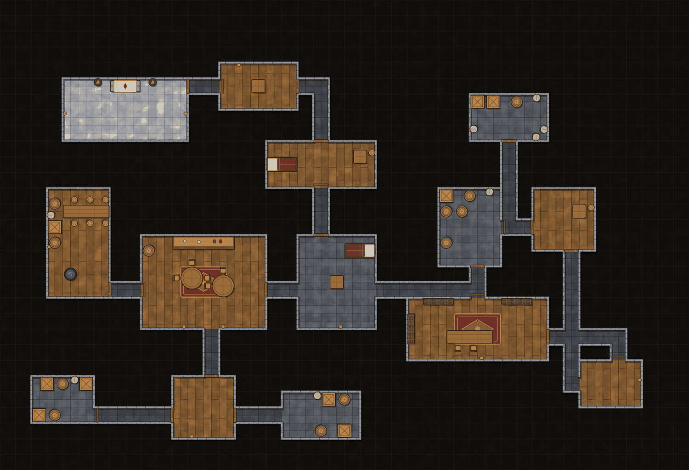
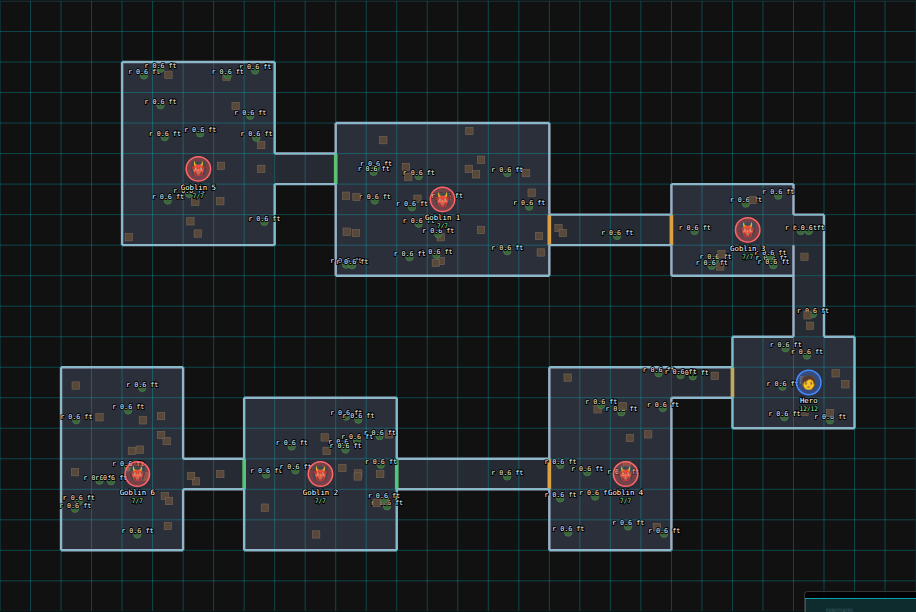
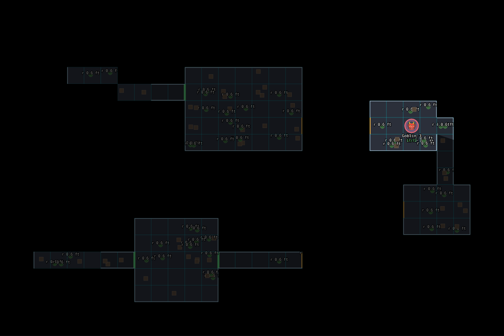
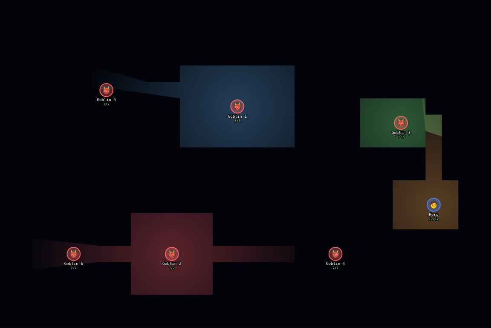
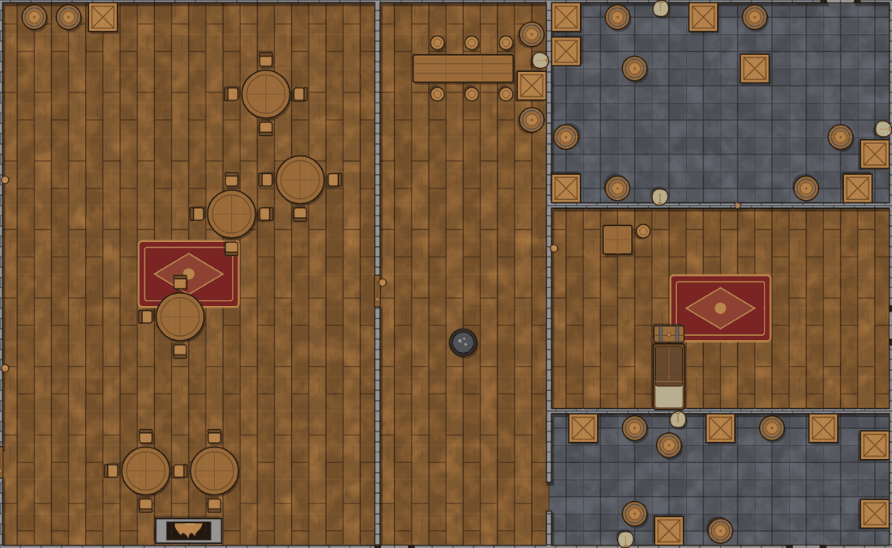

# From schematic editor to a full TTRPG map creator — research, round two

Question: *how do we turn the schematic maps into a full-blown TTRPG map creator?*

**Status: researched and prototyped; nothing in the application was changed.** Round one (the previous version of this file) described the landscape from search summaries and measured one thing. Round two went to the primary
sources, **built and tested** the parts that decide the strategy (≈ 1,500 lines of prototype modules, 64 tests, [`map-creator-research/prototypes/`](map-creator-research/prototypes/)), ran the fog inside the **real player view**
of the running app, audited the whole map stack in the code, and found — and verified a patch for — a real defect. The evidence for each claim is in four appendices:

| Appendix | Contents |
|---|---|
| [CURRENT_STACK_AUDIT.md](map-creator-research/CURRENT_STACK_AUDIT.md) | how the app is used, what exists, **defects with reproductions**, what to keep |
| [FORMATS.md](map-creator-research/FORMATS.md) | Universal VTT, Foundry v13 and Owlbear read from a real file, working converters and type definitions; conversion matrix; export cost |
| [COMPETITORS.md](map-creator-research/COMPETITORS.md) | tools, community needs, Foundry performance data, licences — each line graded A/B/C |
| [PROTOTYPES.md](map-creator-research/PROTOTYPES.md) | what was built, how to run it, every measurement, pictures, limits |

**Evidence tags used below:** **[measured]** run here, numbers given · **[tested]** a prototype does it and a test pins it · **[primary]** read from a real file, type definition, licence or README ·
**[secondary]** a search summary or a page the sandbox could not open · **[inferred]** my reasoning, worth checking. The sandbox has **no GPU**, so rendering speed on real hardware is the main thing still unmeasured.

**Built since this research (October 2026):** the D1 patch (a player can no longer brick a map with `NaN`/`Infinity`); zoom, pan and pinch in the player view (`static/js/map-viewport.js`, Node-tested); live updates through the world's change counter (the poll is now a 20 s safety net); Leaflet vendored; **TV mode** - a map on the second screen, one grid square = one inch once the screen size is known (`/display/map/{slug}`); a **prop library** to import map objects as PNG, JPG, WebP, GIF, AVIF, BMP, TIFF or SVG (`app/prop_images.py`, `app/routers/map_props.py`, with a hardened SVG allow-list); and **AI Build plan mode** - the model plans rooms and links, `app/map_layout.py` lays out walls, doors and furniture (a Python port of the building/furnishing ideas from the prototypes). **Walls, doors, windows and secret doors as data, with table-trust fog of war in the player view and on the TV** (`app/map_walls.py`, `static/js/map-vision.js`, `map-fog.js`, the editor's 🧱 tool); **Universal VTT import** (`app/uvtt_import.py`, a Dungeondraft/Dungeon Alchemist file becomes a playable schematic) and **export as Universal VTT and as a Foundry v13 scene** (`static/js/map-export.js`, the editor's ↓ VTT and ↓ Foundry buttons; the Python importer reads the browser's export back in a test). **Room drawing** (WP5's core: the editor's 🏠▦ tool - paint floor on the grid, walls follow from "an edge between different spaces", door/window/secret/open marks on walls, room names and kinds, undo; `static/js/map-rooms.js`, `app/map_rooms.py`). This covers WP0-WP4 and most of WP5, plus the first parts of WP6. **Lights and darkness** (the 💡 tool, a darkness level, a lantern every character carries; coloured light with shadows from the walls, creatures standing in the dark are not seen; imported from and exported to Universal VTT and Foundry; `static/js/map-light.js`, `map-fog-glue.js`). **Strict secrecy (S2, WP9)** is built: with fog on and the *Strict secrecy* box ticked in Walls & fog, the server computes what the party has seen (a Python port of the browser's visibility sweep, `app/map_strict.py`) and sends players only that - elements, walls, lights, creatures only while seen, the explored area, and a masked copy of the map picture at `/maps/schematic/{slug}/bg.webp`; the original picture file is refused to players. Known limits: explored squares are recorded when a view loads (not on every drag), a room shape that touches an explored square is sent whole, darkness stays a browser effect, sight with no limit means 30 squares, and a secret door stays a wall for players even when the GM opens it. **Not yet verified:** that Foundry, Roll20 and Owlbear accept the exported files (no live instance was available), light speed on a real phone (at most 12 lights are drawn at once, nearest the party first), and any real-hardware speed.

---

## 1. The answer

1. **Do not start with a new editor or a new renderer.** What the evidence supports is a different order: first make maps *playable* — scale, walls, doors, light, fog, on the second screen and on phones, plus Universal VTT
   in and out — on the SVG stack you already have; *then* add a grid-based creator on top of the same stack; WebGL only if measurements ask for it.
2. **The renderer rewrite is not a prerequisite.** Fog of war, line-of-sight and coloured lights with shadows work **inside the existing SVG player view**: ≈ 2–10 ms of JavaScript per update, invisible inside a frame up to
   ~1,300 elements, and the cost does not grow with the number of props **[measured]**. Round one's claim that "the renderer has to change before features are added" is withdrawn. (The *editor's* rebuild-everything
   `redraw()` is a real problem; it can be fixed incrementally.)
3. **A realistic map is small.** A generated 100 × 70-cell dungeon (78 rooms) has **749 wall segments**; a 200 × 140 one has 2,878 **[measured]**. Round one's stress numbers (2,000–5,000 random walls) were not representative.
4. **Walls should follow from rooms.** On a grid, "an edge between two different spaces is a wall" is exact, integer, instantly recomputable and testable; doors, windows and openings are marks on edges **[tested]**.
5. **Interchange is cheap and buys the whole ecosystem.** I read a real Dungeondraft export and two independent converters: a UVTT file can be read, written and turned into a valid Foundry v13 scene
   **[tested]**; the walls are ~5 KB, the PNG is the cost (≈ 1 s to encode a 6.5-megapixel map in the browser) **[measured]**. A Dungeondraft map can then be *run* here — you do not have to out-draw Dungeondraft.
6. **Let the AI plan and the code build.** From a room graph or a seed, deterministic generators produce *furnished, editable* dungeons, caves and buildings in milliseconds; props and textures drawn in code mean **no third-party art
   and no licence to track**. See the pictures in §3. Naive wall detection on a picture, by contrast, marks every wall but only **26–43%** of what it marks is a wall **[measured]** — picture → map needs *assisted tracing*.
7. **Fix what is broken first.** One request from a player can brick a map for everyone (§2, D1); players cannot zoom or pan the map; maps poll instead of using the live bus; the second screen cannot show a map; the map viewer
   loads Leaflet from unpkg. A verified patch for the first is in `map-creator-research/patches/` (not applied).
8. **Decisions that need you** are in §7 — chiefly *where your players look at the map* (a TV on the table, phones, or Foundry), because that decides what gets built first.

*Seed 5, 44 × 30 cells, 14 rooms, 76 props, 131 wall segments — generated and furnished in code, one 64 KB SVG. Props and textures are first-party; the only inputs are a seed and room kinds.*

### What changed since round one (corrections)

| Round one said | Round two found |
|---|---|
| the editor has **no scale** | wrong: the grid dialog has units per cell + a unit label, a 📐 Calibrate tool, and `pxToUnits` feeds measure/AoE/circle labels; what is missing is geometry in cells, walls, and any use of the scale beyond labels |
| the renderer has to change first; zoom fell to 3 fps at 12,000 objects | that measures the *editor's* redraw design; fog/vision/lights add ≈ 0 on top of it (§1.2); a realistic map has hundreds to ~3,000 objects |
| Foundry wall restriction values are 0/10/20/30/40 for `move`, `light`, `sight`, `sound` | `move` accepts **only 0 and 20**; wall coordinates and light positions must be **integers**; light `shadows` is a number, not a boolean; grid size ≥ 20 [primary, types] |
| UVTT: `map_origin` is just a field | real exports have a **non-zero origin and absolute coordinates**; a window is just a portal; `objects_line_of_sight` is real and a single round prop is 59 wall segments |
| union rooms with `polygon-clipping` to get walls | unnecessary on a grid (edges between different spaces); only free-form polygons need it |
| roadmap: authoring core (Phase 1) before live play (Phase 2) | evidence points the other way: playable maps first (§5), creator second |
| `preview.svg` / docs drift | no leak (`preview.svg` is GM/assistant-only); `AI_SCHEMATIC_GUIDE.md` is outdated; freehand strokes never show in previews |

---

## 2. Where nd-world is today (short; full audit in [CURRENT_STACK_AUDIT.md](map-creator-research/CURRENT_STACK_AUDIT.md))

Two map systems and a legacy one. **Image maps** (`/maps`) are a picture with markers and regions in Leaflet — and Leaflet is the *only* external script left in the templates (unpkg), which breaks the app's own offline rule.
**Schematics** (`/maps/schematic/{slug}`) are a 2,356-line inline-script SVG editor with tokens linked to characters, entities and the combat tracker, a player live view that polls every 4 s, merchants and item pickup, an AI Build
that asks a model for raw coordinates, an importer, and a scale dialog. The **second screen** (`/display`) shows an image or a text card — never a map. There is **no map tool in the MCP server**.

**Defects found (each reproduced against the real app):**

- **D1 — a player can brick a map with one request.** `move-token` accepts `NaN`/`Infinity` (Python's `json` does); the value is stored, then `view.json` returns 500, the player page's `JSON.parse` throws, **and the GM editor's own
  `JSON.parse` throws** — the GM cannot repair it in the UI. Also accepts a token at 1e300. Patch (+ regression test, 19 + 224 related tests green): [`map-creator-research/patches/move-token-finite-numbers.patch`](map-creator-research/patches/move-token-finite-numbers.patch).
- **D2** — the player view has no zoom, pan or pinch; a 3000 × 2000 map on a phone is unreadable; dragging a token rebuilds every node on every pointer move.
- **D3** — no map route calls `live.touch`; every player downloads the full element list every 4 s: wasteful rather than broken (the app gzips: ≈ 10–40 KB per poll for a realistic 1,000–4,000-element map, ≈ 190 KB at 12,000).
- **D4** — documentation drift (AI_SCHEMATIC_GUIDE says "GM-only"; API_REFERENCE says `preview.svg` is player-reachable); `preview.svg` is a second, Python renderer that draws a subset of the element types.

---

## 3. What was built and what it showed

(Details, numbers and caveats: [PROTOTYPES.md](map-creator-research/PROTOTYPES.md).)

**Walls from a grid of spaces** — `ids[y*w+x]` and one rule. Merged into long segments (cuts the list to well under 60%), chained into UVTT polylines, caves as marching-squares outlines. A pitfall the tests caught:
simplified cave outlines run *through the middle of floor cells*, putting a token on a wall; chamfered outlines stay ≥ 0.35 cells away.

**Generators** — seeded dungeon, cave, and building-from-a-room-graph. Same seed → same map; every room reachable (75 maps); doors only between room and corridor; links between rooms that do not touch are *reported*, never guessed.

**Vision** — angular sweep, **0 disagreements with an independent line-of-sight oracle in 202,500 points**; one rule for walls, doors, secret doors and windows so fog and movement cannot disagree. Per 6 viewers: range-limited
(≤ 16 cells) ≈ 2–5 ms at any realistic size; unlimited needs the 5.5 KB `visibility-polygon` (MIT) sweep (≈ 1–4 ms per viewer at 2,900 segments) — a naive version is fine only below ~200 segments. Server-side Python:
0.4–1.8 ms per viewer with numpy, 4–17 ms plain at range 16 (numpy is not a dependency today).

**Fog and light in the real player view** — see the table in PROTOTYPES §4. A mid-range-phone stand-in (CPU ×4–×6): one viewer ≈ 10 ms of JS and 60–70 ms to the next frame; 30 lights is too many (cap ≈ 10 on phones).

| GM sees everything | Player sees what the party has seen | Light and shadow |
|---|---|---|
|  |  |  |

**Props, textures, "populate this room"** — 24 props and 9 textures drawn in code; nine room kinds furnished by rules with no overlaps, clear doorways, deterministic seeds (10 tests). Rooms from a spec:

**Picture → walls** — see §1.6. **Export** — see §1.5 and FORMATS §7.

---

## 4. Strategy options

The question of *which first* depends on how the maps are used, so the options are compared against each use (✔ strong, ~ partial, ✘ none):

| | **A. Runtime-first** | **B. Creator-first** (round one's order) | **C. Hybrid — recommended** | **D. Interchange only** |
|---|---|---|---|---|
| What it is | scale + walls + doors + lights + fog on the existing SVG stack, second-screen map, UVTT in/out | new editor and WebGL renderer, assets, generators, then live play | **A first, then a grid-based creator on the same stack**, generators + AI spec, WebGL only if measured | export/import UVTT and Foundry scenes, nothing else |
| TV on the table | ✔ (fog, scale, one fog for the party) | ~ (late) | ✔ | ✘ |
| Players on phones | ✔ (with zoom/pan) | ~ | ✔ | ✘ |
| Foundry/Roll20 users | ✔ (export) | ✔ (later) | ✔ | ✔ |
| Make a new map in-app | ~ (walls tool, import) | ✔ | ✔ (rooms, generators, AI) | ✘ |
| Differentiation (lore + combat link + AI + offline) | ✔ | ✔ | ✔✔ | ✘ |
| Effort / risk | **low–medium**, no rewrite | **high**, rewrite + art | medium, staged | very low |
| Rewrites the editor first? | no | yes | no (adds a mode) | no |
| Evidence it works | prototypes in the real page | none yet | prototypes of both halves | converters tested |

**Why C.**
1. The fog works in the page that exists — so "runtime" is the cheapest big step and serves in-person *and* remote play **[measured]**.
2. UVTT in/out means good-looking maps can come from tools whose art you cannot match; nd-world runs them with tokens, combat link and lore.
3. What nd-world can offer that those tools cannot is *speed and lore*: a furnished, editable map from a seed or a spec, linked to entities — not hand-painted art. The generating logic for that exists as tested prototypes; the editor, persistence and permissions around it do not.
4. A WebGL rewrite buys what the data says is not the bottleneck (Foundry itself needed *batching* of wall and token display objects, not a different renderer **[primary: Codas performance README]**).
5. Staged delivery keeps legacy schematics working: the new data (walls, runtime state) sits *beside* `elements_json`.

**What would change the recommendation:** *most of your maps are pictures* (AI or purchased) → bring "picture → playable" (calibration + assisted tracing, WP8) forward; *you want hand-painted art inside nd-world* → option B grows a painting layer;
*remote play with players you do not fully trust* → bring strict secrecy (WP9) forward; *the table is on Foundry* → export first.

---

## 5. Design and roadmap for option C

### 5.1 Data

Keep `elements_json` (legacy decoration, tokens). Add **beside** it (all columns need `_heal_table` entries):

| Column | Holds | Written |
|---|---|---|
| `walls_json` | walls, doors, windows, secret doors, light-blocking objects: `{id, pts, kind}` in the map's own pixels (the unit existing elements use; `cell_size` from the grid gives cells) | when the GM edits geometry |
| `runtime_json` | door states, light switches, **explored cells per viewer** (run lengths), static fog regions | small, often (a door toggle, a move) |
| `revision` | integer; `409` on a stale save; also the ETag of the geometry | every save |

New element types in `elements_json`: `light` (x, y, range, colour, intensity), `prop` (asset id, x, y, rotation) — old schematics open unchanged. Hex grids: walls are free segments (UVTT and Foundry have no hex walls).

### 5.2 Secrecy — choose a tier consciously

| Tier | What players receive | Cost | Use |
|---|---|---|---|
| **S0** (today) | everything except `hidden` elements and non-visible tokens | – | |
| **S1 table-trust fog** (what the prototype is) | all geometry; the browser masks it | low | in-person, trusted players. A player with dev tools can read the whole map — **say so in the UI** |
| **S2 strict** | only the geometry/props the viewer has seen, plus the explored mask | server vision per move (plain Python ≈ 4–17 ms at range 16; unlimited vision needs numpy or the browser), a Python port tested against the JS vectors | remote play, secret levels |

Build S1; shape the payload (`walls_for_viewer(...)`) so S2 slots in. **Every server-side renderer and export must go through the same filter** (today `preview.svg` and `view.json` are separate code paths).

### 5.3 Second screen ("TV mode")

`/display` gains a map item: the player view without chrome, **one fog for the party** (union of the player characters' vision), SSE-driven (`live.touch`), with a **calibration** step so one grid square is one inch (screen
diagonal + resolution, or a ruler). One-inch squares visible on a 16:9 screen: 32″ ≈ 27 × 15 · **43″ ≈ 37 × 21** (102 px/in at 4K) · 50″ ≈ 43 × 24 · **55″ ≈ 47 × 26** (80 px/in) · 65″ ≈ 56 × 31 — so a 30 × 20 dungeon fits a 43″ TV
whole and bigger ones scroll or zoom [inferred arithmetic; calibration practice **[secondary]**]. The GM keeps the full view and token control on the laptop.

### 5.4 Interchange, AI, MCP

- **Import** UVTT as a new importer kind (`.dd2vtt/.uvtt`): picture (converted by the existing image pipeline) + walls + doors + lights + scale; a report of what was dropped (secret doors, locked state, window semantics).
- **Export** UVTT + PNG and a Foundry scene JSON, built in the browser from the SVG (FORMATS §7); import the result into a real Foundry and Roll20 once before shipping.
- **AI** — `POST …/generate` as a background job (listed in `TASK_PATH_PATTERNS`), the model returns a *spec* (room kinds, sizes, links, lore entity ids) through the structured-output path, a `clean_map_spec` validator (the `template_draft.py`
  pattern) rejects anything else, the generators lay it out, the GM accepts a *draft*.
- **MCP** — `list_maps`, `get_map`, `create_map_from_spec`, `set_door_state`, `place_prop`, `add_light` (GM-only; tests in `tests/test_mcp.py`'s module as AGENTS.md requires).

### 5.5 Work packages

Sizes are **estimates**: one developer with AI assistance, focused days, ±50%, derived from the prototype (≈ 1,500 module lines + 780 test lines for the logic; production adds UI, persistence, permissions, docs and review, a factor of ~3–5).

| WP | What | Days | Main new code | Done when |
|---|---|---|---|---|
| **0** | No-regret fixes: **apply the D1 patch**; zoom/pan/pinch for the player view (a pure `viewport.js`, Node-tested); `live.touch` on map writes + SSE in the views; vendor Leaflet; fix doc drift | 2–3 | ~300 lines | a NaN token is refused; a phone can zoom the map; no unpkg; players stop polling |
| **1** | Walls/doors/windows/lights as data with scale: columns, validation (`clean_walls`: finite, bounded, ≤ 5,000), `revision`/409, editor tools "wall, door, window, light" snapping to the cell lattice | 4–6 | ~700 | a drawn room has walls; old schematics unchanged; tests for limits and permissions |
| **2** | Fog/vision/lights in the player view: productionise `vision.js`, `fog-svg.js`, `light-svg.js` (+ vendored `visibility-polygon`), per-viewer explored memory, GM controls (reveal/hide/reset, door toggle, light on/off), **static fog first** | 5–7 | ~800 | the three screenshots above, in the real page, with a *player payload test* stating what S1 does and does not hide |
| **3** | Second-screen TV mode + calibration | 2–3 | ~300 | a map on `/display` at one inch per square, following the GM live |
| **4** | UVTT import/export + Foundry scene, warnings report | 4–6 | ~700 | round trip nd-world → UVTT → nd-world intact; the real-sample fixture imports and plays; one manual import into Foundry and Roll20 |
| **5** | Grid-based creator mode: paint rooms/corridors, auto walls, door/window tool, prop palette (first-party + GM uploads), floors/textures, patch-based undo, **incremental redraw** | 10–15 | ~2,500 | the §3 picture can be drawn by hand; budgets below met |
| **6** | Generators + AI spec + MCP tools + importer kind | 5–8 | ~900 (≈ 500 are the existing prototypes) | same seed → same map (tested); a spec produces an editable map; MCP can create one |
| **7** | Lore links: room/prop ↔ entity, "open lore from the map", the map on the entity page, room text in the AI context | 3–4 | ~400 | clicking a room opens its entity; the entity page shows its map |
| **8** | Picture → playable: calibration wizard, **assisted tracing** (snap to edges found in the browser), grid/scale detection | 4–6 | ~600 | an AI battlemap becomes a playable map in minutes |
| **9** | *(if needed)* strict secrecy S2: Python vision (range-limited), per-viewer payload filter | 4–6 | ~600 | a player's network payload contains no unseen geometry (tested) |
| **10** | *(only if measured)* renderer upgrade: run `render-bench.html` on real laptop and phone first | 1 to decide, then 15+ | – | numbers on real hardware justify it |

**Core of the recommendation (WP 0–4): about 17–25 days. The creator (WP 5–8): about 22–33 more.**

Budgets to make "done" testable **[inferred, informed by the measurements]**: vision update for 6 viewers < 10 ms at 750 walls (range-limited) or < 30 ms (unlimited, library); fog update ≤ 1 frame up to 1,300
elements; initial load of a 3,000-element map < 2 s; unchanged geometry costs a `304`; the player payload for a 100 × 70 dungeon with 3,000 props stays under 50 KB gzipped (the existing element format measures 44 KB: 573 KB elements + 51 KB walls raw).

### 5.6 Threat model for the new surface

| Risk | Control |
|---|---|
| a player-writable number poisons the document (D1) | every such field is validated: finite, typed, bounded; tests with `NaN`, `1e999`, strings, booleans |
| hidden geometry reaches a player | one `walls_for_viewer` / filter function used by `view.json`, the page, `preview.svg`, exports and the second screen; a test that diffs payloads |
| script in labels or imported names | existing `esc()`/`tojson` discipline; imported text never inserted as HTML; props are **first-party SVG strings or `` of an upload**, never inlined user SVG |
| import bombs: huge JSON, thousands of polylines, 100 MB base64 images | caps on bytes, polylines, points, walls (≤ 5,000), image pixels (Pillow's limit), reject non-finite numbers |
| races | door toggles and explored-memory writes use the existing `BEGIN IMMEDIATE` read-modify-write pattern; `revision` 409 for editors |
| permissions | new player routes in `_is_player_safe`, editor routes in `_is_assistant_safe`, every route a row in `API_REFERENCE.md` (a test enforces it) |
| accessibility | SVG keeps text selectable; door state by icon *and* colour; keyboard movement for own token; honour `prefers-reduced-motion` for fog fades |

---

## 6. Risks

| Risk | Mitigation |
|---|---|
| "full-blown" has no end | every WP has a *done when*; interchange buys features without building them; no art competition |
| table-trust fog mistaken for secrecy | say so in the UI; S2 designed in; payload tests |
| SVG hits its ceiling (≳ 6,000 visible objects, many textured sprites) | WP10 with real-device numbers; incremental redraw (WP5) first |
| phone performance | cap lights (~10), range-limited vision, cull to the viewport, measure on a real phone |
| UVTT/Foundry dialect drift (Foundry v14 data model) | sample-file fixtures; best-effort import with a report; re-check against a live Foundry before each release |
| asset licensing | first-party MIT art only in the repo; GM uploads are the GM's; no community pack is bundled (COMPETITORS §4) |
| single-process SQLite server | runtime writes are tiny; geometry is cached by ETag; no per-frame writes |
| generators look repetitive | seeds + room kinds + GM edits; grow the prop/recipe set; AI chooses kinds, not coordinates |

## 7. Decisions needed (my default in brackets)

1. **Where do players look at the map** — a TV on the table, their own phones/laptops, Foundry? [all three; TV + phones first, Foundry export next]
2. **Secrecy standard** — table-trust (S1) or strict (S2)? [S1 now, S2 designed in]
3. **First scale** — battle maps and dungeons; world/region maps (Leaflet + terrain) later? [battle maps]
4. **Assets** — first-party MIT art + GM uploads, nothing bundled from community packs? [yes; note `static/maps` and `static/schematics` are CC BY-NC-ND content — new art should live under a clearly MIT path]
5. **Creator ambition** — grid rooms + props + generators (fast, editable), or hand-painted art (Dungeondraft-class)? [grid + generators; import for painted art]
6. **Who edits** — GM and assistants with revision conflicts, or locking? [revision/409]
7. **AI** — spec-based generation with lore entity links as a background job? [yes]
8. **Apply the D1 patch now?** [yes — it is a verified fix for a one-request outage]

## 8. Not measured, and how to measure it

| Unknown | How |
|---|---|
| frame rates of SVG, Canvas, Konva and Pixi with thousands of objects on **real GPUs** and a mid-range phone | run `docs/map-creator-research/render-bench.html` (`?n=1000/5000/12000/30000`) on a laptop and a phone; repeat the fog harness with `--throttle` on the phone itself |
| whether the exported files import into Foundry, Roll20, Owlbear | import `prototypes` output once into each |
| how AI-drawn pictures behave under wall detection | needs a GPU image model; try 20 pictures through `wall_detect_experiment.py`-style scoring with hand-traced truth |
| Safari/Firefox behaviour of SVG masks and blend modes | run the harness pages there |
| what your table actually does | §7.1 |

## Sources

Graded in [COMPETITORS.md](map-creator-research/COMPETITORS.md) and [FORMATS.md](map-creator-research/FORMATS.md). **Opened in this research (primary):** `exampleMaps/sampleMap.dd2vtt` and `sampleMap.dungeondraft_map`
([Imagix/uvtt2fgu](https://github.com/Imagix/uvtt2fgu), BSD-3-Clause); `dungeondraft-mcp` 0.1.0 (npm, MIT); [shadowfray/donjon2uvtt](https://github.com/shadowfray/donjon2uvtt);
`@league-of-foundry-developers/foundry-vtt-types` 13.346.0-beta; `@owlbear-rodeo/sdk` 3.1.0 (MIT); [Codas/foundryvtt-performance-hacks](https://github.com/Codas/foundryvtt-performance-hacks);
[ThreeHats/auto-wall](https://github.com/ThreeHats/auto-wall) (MIT); [dungeon-revealer](https://github.com/dungeon-revealer/dungeon-revealer) (ISC); [Azgaar's Fantasy Map Generator](https://github.com/Azgaar/Fantasy-Map-Generator) (MIT);
`familiar-vtt` (npm README); the nd-world source at `1774216`. **Summarised by the search tool only (secondary):** Arkenforge, Dungeon Alchemist, Dungeon Scrawl, Roll20 UVTT support, Forgotten Adventures licensing, Watabou, Kenney, game-icons.net,
2-Minute Tabletop, TV-table guides, the Foundry optimisation guides, the Owlbear Scene Importer and Dynamic Fog pages. Library facts (sizes, licences) from the npm registry: pixi.js 8.22.0 (MIT, 841 KB min), konva 10.7.1 (MIT, 194 KB),
visibility-polygon 1.1.0 (MIT, 5.5 KB), polygon-clipping 0.15.7 (MIT, 29 KB), rbush 4.0.1 (MIT), delaunator 5.1.0 (ISC), d3-delaunay 6.0.4 (ISC).

Round one's measurements (SVG redraw 200 → 12,000 objects, random-wall vision, union cost, payload sizes) were taken in the same sandbox and are unchanged; the interpretation of the first is what §1.2 revises.
