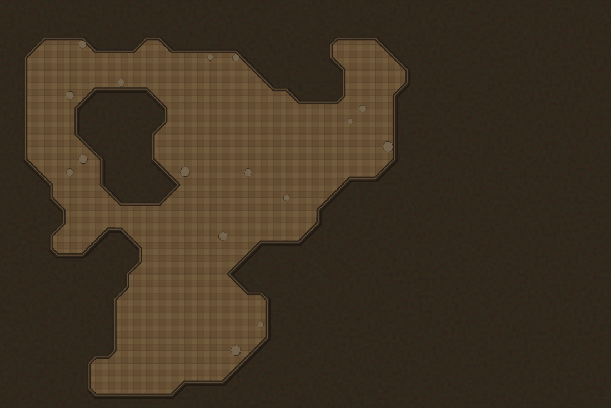
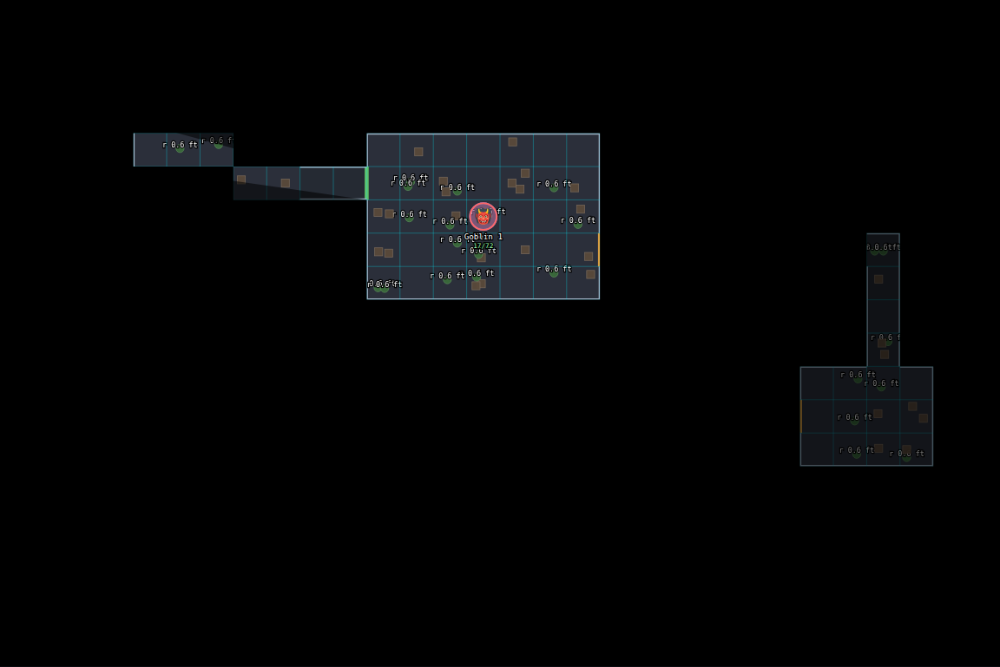
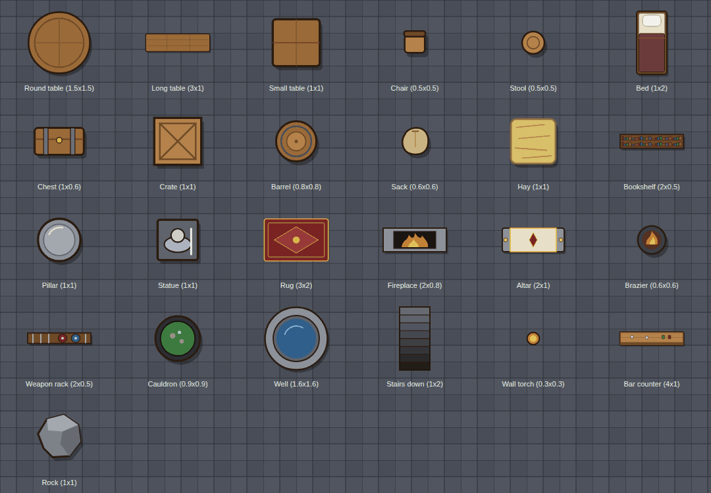
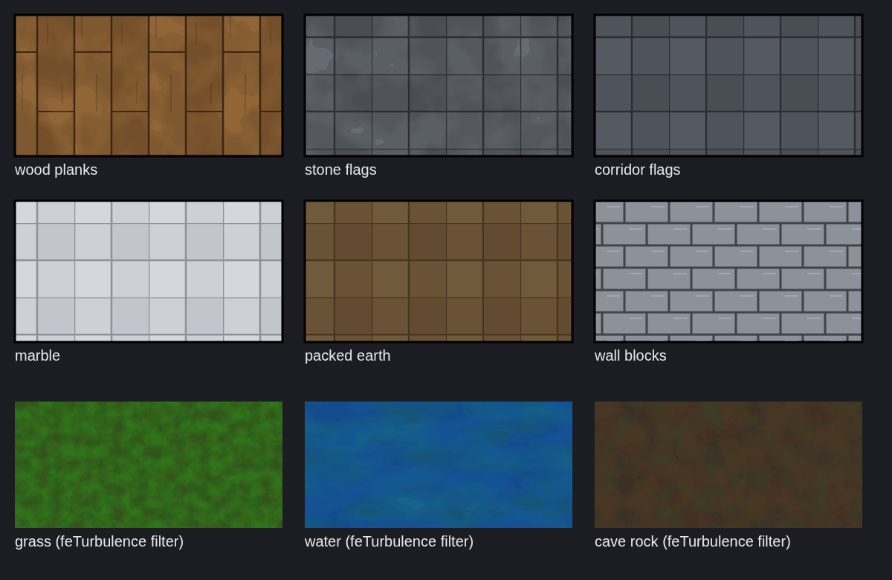

# Prototypes and measurements

Companion to [`../MAP_CREATOR_RESEARCH.md`](../MAP_CREATOR_RESEARCH.md). The first round of this research measured random wall soup and described things. This round **built** the parts that decide
the strategy, tested them, and measured them on *generated realistic maps* and — for the fog — inside the **real player view** of the running app.
All code is in [`prototypes/`](prototypes/) (plain JavaScript modules in the repo's `ndDiceGeometry` style: they run under Node and in a browser; ~1,470 lines of modules, ~780 lines of tests).

```bash
node --test "docs/map-creator-research/prototypes/*.test.js"    # 64 tests, ~1.5 s (or: cd into the folder and run `node --test`)
VP_PATH=/path/to/visibility-polygon node docs/map-creator-research/prototypes/bench.js
node docs/map-creator-research/prototypes/export_for_py.js > /tmp/maps.json && python3 -I docs/map-creator-research/prototypes/vision_bench.py /tmp/maps.json
python3 -I docs/map-creator-research/prototypes/fog_spike_harness.py --shots OUT [--throttle 4] [--quick]   # boots the real app on a scratch database
node docs/map-creator-research/prototypes/make_sheets.js OUT 5 && python3 -I docs/map-creator-research/prototypes/rasterize.py OUT   # the pictures
python3 -I docs/map-creator-research/prototypes/export_image_spike.py OUT                                    # in-browser UVTT export cost
python3 -I docs/map-creator-research/prototypes/wall_detect_experiment.py sampleMap.dd2vtt                   # numpy + scipy + Pillow
```

None of this is wired into the application, and nothing in `tests/` or CI depends on it. Every number below was measured in the research sandbox: Node 22, Python 3.11, headless Chromium
with **software rendering and no GPU** (paint times are pessimistic; JavaScript times are of the same order as a laptop's).

| Module | What it does | Tests |
|---|---|---|
| `gridwalls.js` | walls from a grid of space ids: an edge between two different spaces is a wall unless it is open or marked door/secret/window; merge into long segments, chain into polylines, outline rings, marching-squares caves | 8 |
| `gen-dungeon.js` · `gen-cave.js` · `gen-building.js` | seeded dungeon (rooms + MST corridors + loops + doors), cave (cellular automata, largest cavern, chamfered walls), building from a room graph | 6 · 6 · 5 |
| `vision.js` | what a token sees / where it may walk, one rule for walls, doors, secret doors, windows; angular-sweep visibility polygon | 8 |
| `uvtt.js` · `foundry.js` | Universal VTT read/validate/write; Foundry v13 scene conversion and schema checker | 9 · 8 |
| `fog-svg.js` · `light-svg.js` | fog of war and coloured lights **inside an existing SVG view** | measured in the real page |
| `assets.js` · `textures.js` · `furnish.js` · `render-svg.js` | 24 props and 9 textures drawn in code; rule-based "populate this room"; the SVG renderer | 10 |

## 1. Walls follow from rooms

`ids[y*w+x]` says which space a cell belongs to; a wall exists on every cell edge whose two sides differ. That is the whole algorithm, and it makes the common creator gesture —
*paint a room, the walls appear* — exact (integer lattice), instantly re-computable, and testable: after any change the wall set is a pure function of the grid.

Merged, a **realistic map has few walls**. Generated dungeons (median of 7 runs):

| Map | Cells | Rooms | Wall segments (walls + doors) | Sight blockers | UVTT polylines | Generate |
|---|---|---|---|---|---|---|
| dungeon 30 × 20 | 600 | 7 | 58 (48 + 10) | 55 | 3 | 1.7 ms |
| dungeon 60 × 40 | 2,400 | 24 | 210 (178 + 32) | 201 | 11 | 4.6 ms |
| dungeon 100 × 70 | 7,000 | 78 | 749 (622 + 127) | 707 | 32 | 13 ms |
| dungeon 150 × 100 | 15,000 | 158 | 1,484 (1,230 + 254) | 1,400 | 61 | 30 ms |
| dungeon 200 × 140 | 28,000 | 311 | 2,878 (2,405 + 473) | 2,707 | 114 | 111 ms |
| cave 48 × 32 | 1,536 | – | 142 | 142 | 3 | 7 ms |
| cave 100 × 70 | 7,000 | – | 676 | 676 | 19 | 13 ms |
| cave 160 × 110 | 17,600 | – | 1,444 | 1,444 | 45 | 28 ms |

Merging unit edges into runs cuts the list to well under 60% (a test pins it). The 2,000–5,000-segment cases of the first round (random walls) are *worse than any realistic map here*.

**A pitfall the oracle test caught:** simplifying a cave's staircase outline (Douglas–Peucker, 0.75 cell) lets a wall pass *through the middle of a floor cell*; a token standing there is on a wall and vision from it
is nonsense (296 of 67,500 sample points disagreed, all from one such observer). The fix, `contourRings` — marching squares on the cell centres — cuts corners by 45° chamfers and stays ≥ 0.35 cells from any
floor centre; a test checks both claims, and another that the rings separate floor centres from rock centres **exactly** on 8 caves.

## 2. Generators: the model describes, code lays out


* **Dungeon** — rooms placed without overlap and with a gap, a minimum spanning tree over their centres plus a few extra loops, L-shaped corridors, doors where a corridor meets a room (some open archways, a few secret).
  Tests: same seed → identical grid; rooms inside the map and never touching; **every room reachable from every other, 75 maps** (a one-off mutation check — door and opening edges made impassable — left 0 of 25 connected, so the test is not vacuous);
  doors only between a room and a corridor; no wall inside a room; walls merged.
* **Cave** — five automata passes, largest cavern kept, chamfered outline.
* **Building from a room graph** — a spec like `[{Common room, 100}, {Kitchen, 44}, …] + links [[0,1,'door'], [3,4,'secret']] + entrance 0` gives rooms that tile the footprint exactly, in proportion to
  the requested areas (±8%), a door on the middle of each shared wall, the entrance on the outside wall, windows on the outside. A link between rooms that do not touch is **reported in `unmet`, never guessed**.
  Known weakness: the slicing treemap produces long thin rooms (the kitchen below is 5 × 16); a squarified layout is the obvious upgrade.




This is the shape an AI feature should take: the model returns the *spec* (kinds, sizes, links, lore entity ids) through the app's structured-output path, a `clean_*` validator checks it (the `template_draft.py` pattern),
and deterministic code does the geometry — the part language models are weakest at (AI Build today asks for raw coordinates). The result is real walls and props, so it stays editable.

## 3. Vision: what it costs

The visibility polygon is the textbook angular sweep. **Correctness** is tested against an independent oracle (does the straight line to a random point cross a wall?): 30 dungeons × 3 observers × 1,500 points,
and 15 caves × 3 × 1,500: **0 disagreements in 202,500 points** (the tests allow 0.2% / 0.4% for rays grazing a corner; lattice walls with cell-centre observers never needed it). Doors, secret doors and windows go through one rule (`blocksSight` / `blocksMove`), so fog and movement cannot disagree.

Cost, per **6 observers** (one table's worth), median ms, Node 22:

| Map | wall segments | my sweep, unlimited | my sweep, range 16 cells | my sweep, range 8 | `visibility-polygon` 1.1.0 (MIT, 5.5 KB), unlimited | its one-off `breakIntersections` |
|---|---|---|---|---|---|---|
| dungeon 30 × 20 | 58 | 1.6 | 1.8 | 1.1 | 3.0 | 1.9 |
| dungeon 60 × 40 | 210 | 15.6 | 5.2 | 1.2 | 2.6 | 2.0 |
| dungeon 100 × 70 | 749 | 130 | 3.2 | 0.9 | 7.7 | 12.9 |
| dungeon 150 × 100 | 1,484 | 451 | 4.2 | 1.0 | 17 | 46 |
| dungeon 200 × 140 | 2,878 | 1,690 | 4.6 | 1.1 | 26 | 155 |
| cave 100 × 70 | 676 | 100 | 2.7 | 0.8 | 3.6 | 11 |
| cave 160 × 110 | 1,444 | 522 | 3.8 | 0.9 | 9.0 | 51 |

Reading: **range-limited vision** (a torch, darkvision: 6–16 cells) is a few milliseconds at *any* realistic size, because the walls are culled to the ones near the viewer; **unlimited vision** (a lit hall) needs the
O(n log n) sweep of the library (≈ 1–4 ms per viewer even at 2,900 segments) — my O(rays × walls) version is fine below ~200 segments and not above. The library's break step is once per *edit*, not per move,
and a door toggle does not need it (a door shares end points with the walls around it).

**Server-side** (only if the server, not the browser, must decide what a player may see), Python 3.11, per observer: numpy **0.4–1.8 ms** at range ≤ 16 (0.8–23 ms at range 40); a plain-Python loop 4–17 ms at range 16
and 7–238 ms at range 40. numpy is **not** in `requirements.txt` (Pillow is); a plain-Python server-side vision is acceptable for range-limited vision at a table of a few players and not for unlimited vision on large maps.

## 4. Fog and light inside the real player view

`fog-svg.js` and `light-svg.js` were injected into the **real** `/maps/schematic/{slug}/view` page of the running app (real server, real routes, real `schematic-render.js`, a player account with a character on the map), no renderer
change. Fog = two covers (never-seen: black; seen before: dimmed) whose `<mask>` is a white rectangle with the visible region and the explored cells cut out as **one `<path>` each**; tokens out of sight are `display:none`.
Explored memory is a one-byte-per-cell grid, stored as run lengths. Lights = a dark cover whose mask has each light's visibility polygon painted as black fading with distance, plus a `screen`-blended colour tint.

| GM sees everything | Player: start, one room visible | Player: after walking (explored cells dimmed) |
|---|---|---|
|  |  |  |


Measured (headless Chromium, no GPU; "to next frame" = from calling `update()` until the second frame after it, an idle page being 33.3 ms = two frames at 60 Hz; the app's own `redraw()` is what the view
already runs on every poll and every drag step):

| Map (walls) | Elements in the view | Case | Fog JS | Update → next frame | Existing `redraw()` |
|---|---|---|---|---|---|
| 60 × 40 (210) | 286 | 1 viewer, range 16 | 3.2 ms | 33.2 ms (idle 33.3) | 3.4 ms |
| 60 × 40 (210) | 1,286 | 1 viewer, range 16 | 1.8 | 33.3 | 25 |
| 60 × 40 (210) | 1,286 | 8 viewers, range 16 | 10 | 33.4 | 27 |
| 60 × 40 (210) | 3,286 | 8 viewers, range 16 | 14 | 70 | 35 |
| 60 × 40 (210) | 6,286 | 1 viewer, range 16 | 1.8 | 69 | 85 |
| 100 × 70 (749) | 1,033 | 1 viewer, range 16 | 2.0 | 33.0 | 16 |
| 100 × 70 (749) | 1,033 | 1 viewer, **unlimited** (my sweep) | **18** | 33.6 | 8 |
| 100 × 70 (749) | 4,033 | 4 viewers, range 16 | 4.3 | 53 | 45 |
| 60 × 40 (210) | 1,286 | **1 / 10 / 30 coloured lights**, range 8 | 2.0 / 6.6 / 11 | 33.2 / 38 / 39 | – |

Findings:
1. **Fog, vision and lights do not need a new renderer.** Up to ~1,300 elements the update is invisible (it finishes inside the frame). From ~3,000 elements the repaint of the masked cover adds
   roughly 20–40 ms in this no-GPU setup — the same order as the view's own `redraw()` (35–105 ms at those sizes), which grows with the element count too. What grows with props is the existing
   rebuild-everything design, not the fog.
2. The fog's own cost is **independent of how many props there are** (JS 2–14 ms at 286 to 6,286 elements) and grows with viewers × walls near them.
3. With the CPU slowed 4× / 6× (a stand-in for a mid-range phone): 1 viewer, range 16 → JS 10 ms, 62 / 72 ms to the next frame; 8 viewers → 40 / 75 ms JS; **30 lights → 64 ms JS, 135–150 ms** — too many; cap lights
   to the visible area (≤ ~10 on phones). Unlimited vision on 749 walls with my sweep: 83 / 144 ms → use the library or range-limit it.
4. What this does **not** show: GPU paint cost (a real GPU is faster at the masked cover, but `mix-blend-mode` and masks are not free on weak mobile GPUs), memory, battery, or Safari/Firefox behaviour. One pitfall hit on the way:
   an opaque black-to-white gradient blended with `darken` inside a mask worked in a toy page but **did not punch holes inside the real page**; black-with-alpha gradients do, with no blend mode (documented in `light-svg.js`).
5. **Secrecy.** The mask hides pixels; the elements are still in the payload. That is "table trust" fog. A strict mode needs the server to send only what is visible (§3, server-side numbers) — see the strategy section of the main document.

## 5. Universal VTT and Foundry converters

Detailed in [FORMATS.md](FORMATS.md): 17 tests, a real Dungeondraft export read, rewritten and compared, converted to a Foundry v13 scene that passes the schema checker; 32 generated maps converted at four grid sizes;
four real `.dd2vtt` files written (1.4–7.9 MB) and read back; the in-browser export costs ≈ 1 s of PNG encoding for a 6.5-megapixel map.

## 6. First-party props, textures and furnishing




* **24 props**, ~90 lines of SVG strings, original, consistent top-down style, a drop-shadow silhouette each; adding one is adding an entry. **9 textures** as SVG patterns (planks, flags, marble, packed earth, wall blocks) and
  `feTurbulence` filters (noise, grass, water, cave rock). No image files, nothing to license. (The noise overlay is the expensive part; a real renderer would bake it once into a bitmap tile.)
* **Furnishing** is rule-based and seeded: nine room kinds (tavern, library, shrine, barracks, kitchen, bedroom, storeroom, hall, cavern) put props against walls (back to the wall), in the middle, or in groups (a table
  with chairs on its four sides), on a half-cell occupancy grid, keeping a clear zone at every door. Tests over 30 rooms × 9 kinds: **nothing overlaps, nothing leaves the room, doorways stay clear,
  the same seed gives the same furniture**, a room big enough gets what its kind promises, a tiny room gets almost nothing. Torches come with a light at the same spot (they feed `light-svg.js`).
* The whole furnished 44 × 30-cell dungeon (14 rooms, 76 props) is **one 64 KB SVG**, well-formed, no scripts or external references (tested), and renders in Chromium in about a second.

Limits: it is a proof, not art direction; props are not rotated freely; no multi-level maps; the recipes are simple (they will repeat across rooms); the style is deliberately plain.

## 7. Picture → walls: naive detection is not enough

AI battlemaps and imported pictures have no walls. One real map gives ground truth: the Dungeondraft sample has both the picture and the true walls. Two naive detectors, scored against the truth with a quarter-square
tolerance (`wall_detect_experiment.py`):

| Detector | Recall | Precision |
|---|---|---|
| strongest 20% of the image gradient | 100% | 36% |
| strongest 10% | 100% | 26% |
| strongest 5% | 88% | 5.5% |
| dark ink, grey < 30 / 50 / 70 | 100% | 39% / 43% / 39% |

The wood planks are drawn with the same ink as the walls, so **everything that looks like a wall gets marked**. This one map cannot say how AI art behaves (there is no GPU here to make any), but it matches the
field's own description of the tools (MIT-licensed Auto-Wall: "a time-saving tool… manual refinement expected"). Design consequence: a picture-to-map flow should be **scale calibration + assisted tracing**
(snap to detected edges, the GM confirms) rather than "detect walls"; running detection in the browser avoids adding OpenCV/numpy to the server image.

## 8. What this does not prove

Real-GPU rendering speed (the bench page `render-bench.html` remains unrun); behaviour in Foundry/Roll20/Owlbear of the files written here; how AI-drawn pictures respond to wall detection; how a GM *feels* editing in a new
UI (nothing here is an editor — it is data, algorithms and pictures); Safari and Firefox. Each is listed as a measurement step in the main document's roadmap.
