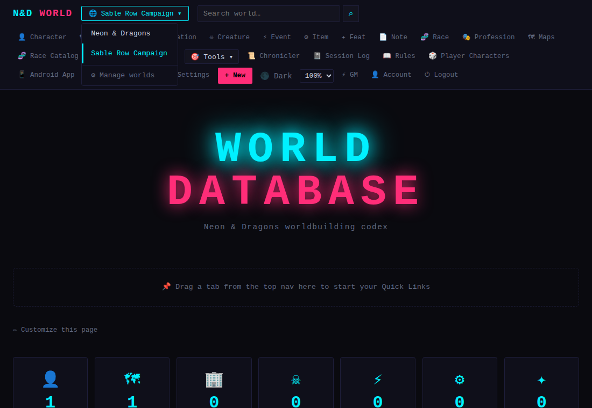
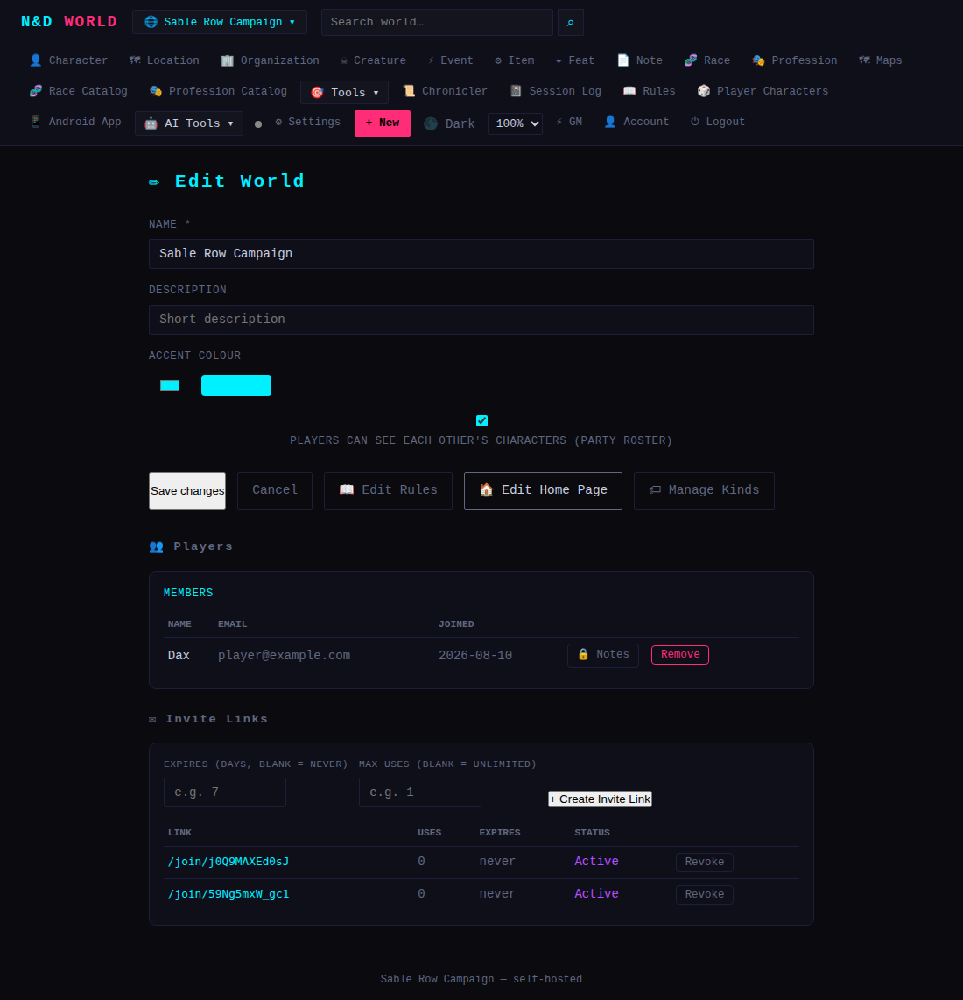

# Getting Started

*Applies to: GM (setup) and Players (joining).*

## First login as GM

If you set `GM_EMAIL`/`GM_PASSWORD` before first start (or ran `scripts/setup.sh`,
which asks for them), that account is already your GM login — go to your
deployment's URL and sign in with those credentials. There is no public
signup; every other account is created by redeeming a GM-issued invite link.

## Create your first world

nd-world is **multi-world**: everything (entities, characters, maps,
sessions, etc.) belongs to exactly one **World**, and you can create as many
as you like — one per campaign, or a scratch world for testing. On first
login you'll be prompted to create one, or use the world-switcher dropdown
(top-left, showing the current world's name) → **⚙ Manage worlds** → **+ New
World**. Give it a name and pick an accent color — that color tints the nav
bar and world-scoped pages, which is handy once you're running several
worlds and want an at-a-glance way to tell them apart.

## Orienting yourself in the nav bar

The nav bar is dynamic — it adapts to your role and to what your world
actually contains:

- The **entity kind tabs** (🧑 Characters, 📍 Locations, 🏢 Organizations, etc.
  — 8 built-in, plus any custom ones the GM has added) always come first.
- **🗺 Maps**, **🧬 Race Catalog**, **🎭 Profession Catalog** follow.
- GM-only: a **🎯 Tools** dropdown groups everything session-running and
  world-management related — Boards, Random Tables, Combat Tracker, Parties,
  Quests, Sessions, Facts, Calendar, Import, Export & Backup, and — once
  enabled — Dreamlands/King in Yellow.
- **📜 Chronicler**, **📓 Session Log**, **📖 Rules**, **🎲 Player Characters**,
  **📱 Android App** are visible to everyone.
- GM-only: an **🤖 AI Tools** dropdown (AI Chat, Image Studio, Content
  Editor), **⚙ Settings**, and the **+ New** button (defaults to whatever
  kind you're currently browsing).
- Far right: your account badge, the theme toggle, a **UI scale** picker
  (90–150%, for readability — also available from Settings > Options), and
  **👤 Account** / **⏻ Logout**.

On mobile, all of this collapses behind a hamburger menu.

**Tip:** you can drag any nav tab or entity-kind link onto the home page to
pin it as a Quick Link — see [Worldbuilding & Entities](Worldbuilding-and-Entities.md#home-page--quick-links).

## Invite your players

Open the world switcher → **⚙ Manage worlds** → **Edit** on the world you
want them in. Under **Invite Links**, click **+ New Invite** — optionally
set a use limit or expiry — and copy the generated `/join/<code>` URL. Send
it to a player (Discord, email, whatever). Opening it lets them create an
account (or log an existing one in) and joins them to that world
automatically. Revoke an invite any time from the same page.

Once a player has joined, you'll see them under **Members** on that same
Edit page, where you can also remove them or open a private **🔒 Notes**
thread with them (visible only to the two of you — handy for
player-specific hooks or secrets).

## Next steps

- As GM: start filling in lore — see [Worldbuilding & Entities](Worldbuilding-and-Entities.md).
- Have your players create characters — see [Characters](Characters.md).
- Set up your first map or battle-map schematic — see [Maps & Schematics](Maps-and-Schematics.md).

---

## Quick example: create a world and invite a player

1. **Open the world switcher** (top-left) — it lists every world you have
   access to as GM. Click **⚙ Manage worlds** from here whenever you want to
   create, rename, or switch worlds.

   

2. **Create the invite.** From **⚙ Manage worlds → ✏ Edit** on the world you
   want a player in, scroll to **Invite Links** and click **+ Create Invite
   Link** — leave Expires/Max uses blank for a link that never expires and
   has unlimited uses, or set them to limit it. Copy the generated
   `/join/<code>` link and send it to your player.

   

3. Once they open the link and sign in (or create an account), they appear
   under **Members** on this same page — see the "Dax" row above. From here
   you can remove them or open a private **🔒 Notes** thread just between the
   two of you.
