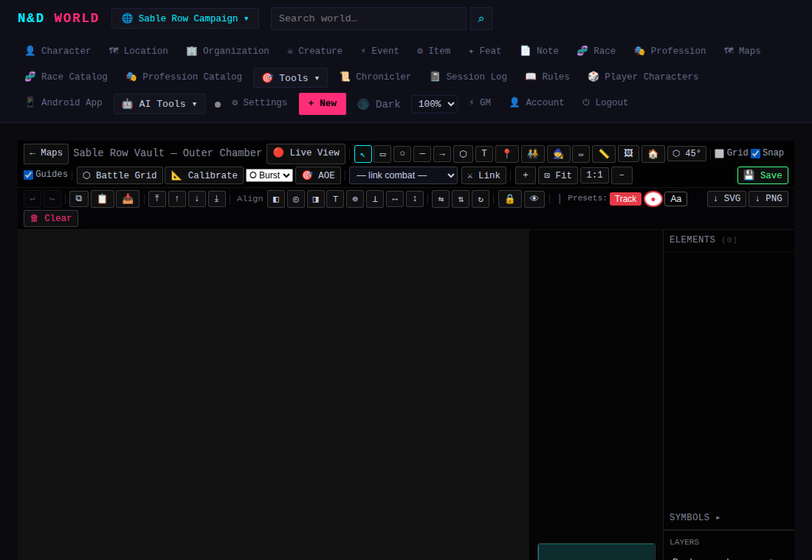

# Maps & Schematics

*Applies to: GM (creating/editing) and Players (viewing, and — on
schematics — moving their own token, buying, picking up items).*

nd-world has two distinct map tools for different jobs.

## Maps — image-based, with markers and regions

**🗺 Maps → + New Map**, upload a background image (a world map, city plan,
whatever). On the viewer, the GM can drop **markers** (pins linked to
entities, or freeform) and draw **region overlays**. Players see the same
map read-only, filtered to whatever the GM has chosen to show.

## Schematics — SVG battle-map / dungeon editor

**Schematics** are a full canvas editor for tactical layouts — think a
simple VTT built in. From the GM editor (`/maps/schematic/{slug}`) you can:

- Draw shapes, place labels, and drop **tokens** (linked to `PlayerCharacter`
  or `Entity` rows, or freeform).
- Set a **grid overlay** — none, square, or hex (pointy or flat orientation),
  with configurable cell size/offset.
- **Embed images** directly into elements via the 🖼 tool (no separate
  upload round trip).
- **Link the schematic to a Combat Tracker session** — 🔗 Link Combat, then:
  - **Pull from Combat** creates/refreshes a token for every combatant.
  - **Push to Combat** writes token HP/max HP/conditions back onto the
    linked combat's combatants.
  This keeps the visual battle map and the numeric initiative tracker in
  sync without hand-copying HP totals back and forth.

## The player view

Players reach a schematic through its **player view** (a live,
auto-updating read version that hides GM-only elements). A non-GM player may:

- **Move only their own token** — the one linked to their `PlayerCharacter`.
- **Pick up an item-token stack** into their character's inventory.
- **Buy from a merchant token** — one stock row at a time; currency and
  stock are deducted and locked against concurrent purchases, so two players
  buying the last potion at once can't both succeed.

## Deleting and renaming

Both maps and schematics can be renamed or deleted from their list pages —
deletion removes the associated uploaded image(s) too.

---

## Quick example: a blank schematic

**🗺 Maps → + New Schematic**, give it a name (and, optionally, a starting
canvas size/background) — you land straight in the editor on a blank canvas,
ready for shapes, tokens, a grid overlay, and the combat-link toolbar along
the top.

Draw the room, drop tokens for your NPCs (linked to their Entity rows so
clicking one jumps to their sheet), set a grid, and — once you're running
the encounter — **🔗 Link Combat** to keep this canvas and the Combat Tracker
in sync.
