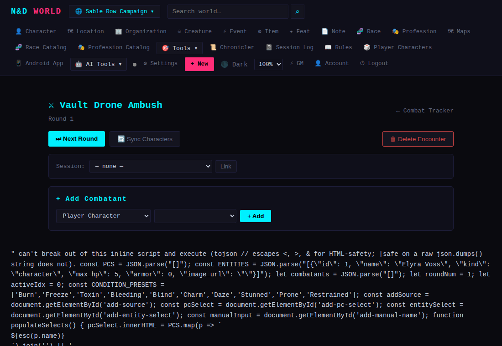

# Running a Session

*Applies to: GM only — these are all under the 🎯 Tools dropdown.*

Four tools for the mechanics of actually running play, independent of the
lore/entity system.

## ⚔ Combat Tracker

**Combat → + New Combat** creates an initiative tracker: add combatants
(pulled from characters/entities or typed freeform), track HP and
conditions, and step through turn order. A combat session can be **linked
to a Schematic** for a visual battle map kept in sync (see
[Maps & Schematics](Maps-and-Schematics.md#schematics--svg-battle-map--dungeon-editor)),
and/or **linked to a Game Session** so it shows up in that session's log.

## 🛡 Parties

A **Party** is a named group of characters — useful once you have more
than one active adventuring group in a world. A party tracks shared
loot/currency and a current in-world location, and **🚀 Launch Combat** spins
up a Combat Tracker session pre-populated with its members.

## 📜 Quests

Simple quest tracking: title, description, status (active/completed/
failed), and — like entities — a `visible_to_players` flag, so you can log a
quest hook before revealing it to the party.

## 🗓 Calendar

An in-world calendar with a configurable epoch (custom month names/lengths,
starting date) for tracking campaign time. Log events on specific in-world
dates, and **advance** the current date by N days between sessions.

## 🎲 Random Tables

GM-authored roll tables (loot, random encounters, NPC name generators,
whatever) — add rows with weights, then **Roll** to get a result. Tables can
be exported/imported as JSON, so a table you've built once is portable
between worlds or shareable with other GMs.

---

## Quick example: starting a fight

**⚔ Combat → + New Encounter**, name it, and you land on the tracker: an
**+ Add Combatant** panel (pull from Player Characters or Entities, or type
one in manually) above an empty initiative order.

Add each side, set initiative, and step through turns — HP/Shock have
quick +1/+5/−1/−5 buttons so you're not retyping totals mid-fight. Link a
Schematic (🔗 Link Combat, from that side) to keep a visual battle map in
sync with these same combatants.
