# Sessions, Facts & AI Recaps

*Applies to: GM (full access) and Players (📓 Session Log, 📜 Chronicler).*

nd-world has two related-but-distinct ways to track "what happened":
**Sessions** (one free-text recap per game session, GM-only) and **Facts**
(a discrete, per-item log with its own visibility flag). Both can be
AI-assisted using your configured local Ollama model — nothing here calls
an external/hosted AI service.

## Sessions (GM)

**🎯 Tools → 📓 Sessions → + New Session** — track prep checklist items, XP
awarded, loot transferred, and a free-text recap (Summary). Because the
Summary is one blob, it can (and often does) contain GM-only secrets — it is
**never** shown to players directly (see Session Log below).

### AI recap assist

On a session's detail page, three buttons above the Summary field:

- **Expand notes** — turns terse bullet notes ("went to the tavern, met
  Elyra") into a written narrative paragraph.
- **Condense recap** — tightens an existing recap into something shorter.
- **Summarize from Facts** — weaves this session's logged Facts (all of
  them, GM sees secrets too) into a recap.

Each shows a preview with **Replace / Append / Discard** before touching
your actual Summary text — nothing is written until you confirm.

## Facts (GM)

**🎯 Tools → 🗒 Facts** — a running log of discrete things that happened
("The party found a hidden data core in the vault", "Elyra is secretly
working for the cult"), each with its own `visible_to_players` flag,
independent of any entity or session's own visibility. This is the
finer-grained alternative to the Sessions' one-blob Summary, and it's what
powers both the Chronicler and the player-facing Session Log below.

**Recap → Facts (AI parser):** paste a rough recap into the panel on the
Facts page and the local model splits it into a reviewable list of draft
facts (content + a suggested visible/hidden flag) — nothing is saved until
you review, edit, and click **Confirm & Save**.

## 📜 Chronicler (everyone)

A chat assistant that answers questions using only the Facts (and matching
entities) the asking user is actually allowed to see — the filtering happens
**before** anything reaches the model, not as an instruction the model could
ignore. A player asking "what happened with Elyra?" never gets the secret
fact fed into their answer, even indirectly; a GM asking the same question
sees everything. Reach it from **📜 Chronicler** in the nav — available to
every logged-in user.

## 📓 Session Log (players)

The player-facing view of session history — **📓 Session Log** in the nav.
It **never** shows the GM's raw Session Summary. Instead, opening a session
here triggers an AI recap synthesized fresh from only the Facts marked
visible to players for that session. If no visible facts are logged yet, it
just says so rather than showing anything. GMs opening the same page get a
recap built from every fact, secret or not.

## Why two systems?

Sessions/Summary is the quick, one-blob GM prep log you'd keep during play.
Facts is the structured, visibility-aware record that everything
player-facing (Session Log, Chronicler, and MCP tools if you use those —
see [Settings, Account & Sharing](Settings-Account-and-Sharing.md#mcp-access-tokens-chat-with-your-world-from-your-phone))
is actually built on. You don't have to use Facts at all — Sessions works
fine on its own for GM-only note-taking — but the moment you want players to
see *anything* about session history, log it as a Fact (or use the "Summarize
from Facts" AI button, or the recap parser) instead of relying on Summary.

---

## Walkthrough: a worked example

Everything below follows one running example so the two perspectives connect:
a GM is running session #4, "The Vault Beneath Sable Row." The party hired a
guide, **Elyra Voss**, who is secretly reporting their movements to a cult —
a classic GM-secret fact that must never reach the players, even indirectly.

### Step-by-step: GM

**1. Open 🎯 Tools → 📓 Sessions and pick (or create) a session.**

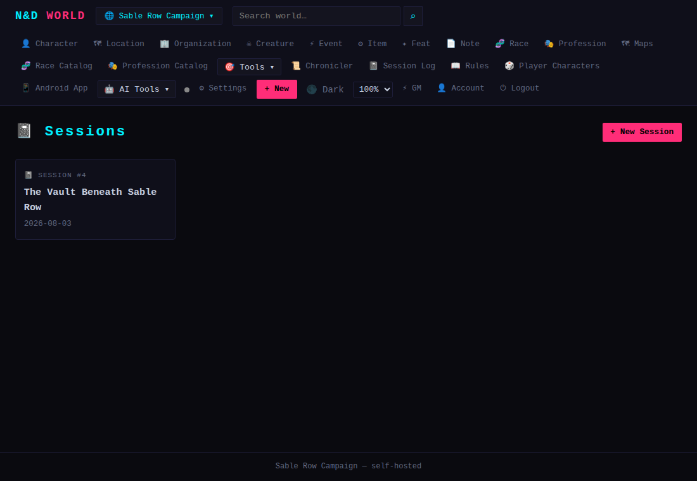

**2. Jot terse notes into the Summary field.**

You don't need finished prose — bullet-style fragments are fine, the AI
button below cleans them up.

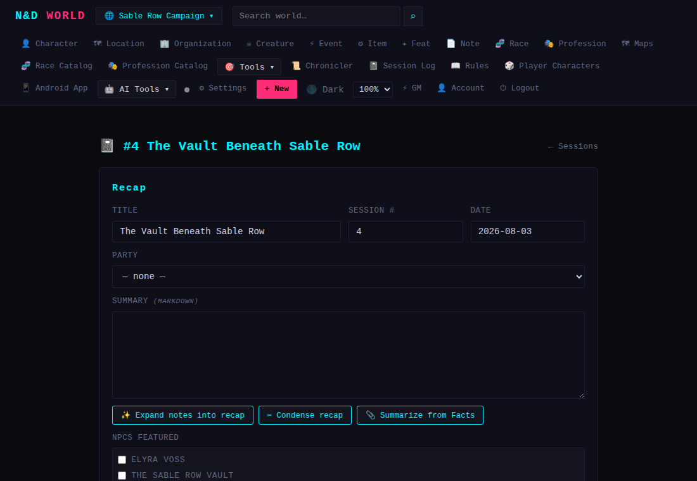

**3. Click "✨ Expand notes into recap" and review the draft.**

The draft appears in a preview panel below the buttons. Nothing is written
to your actual Summary yet — you choose **Replace**, **Append**, or
**Discard**.

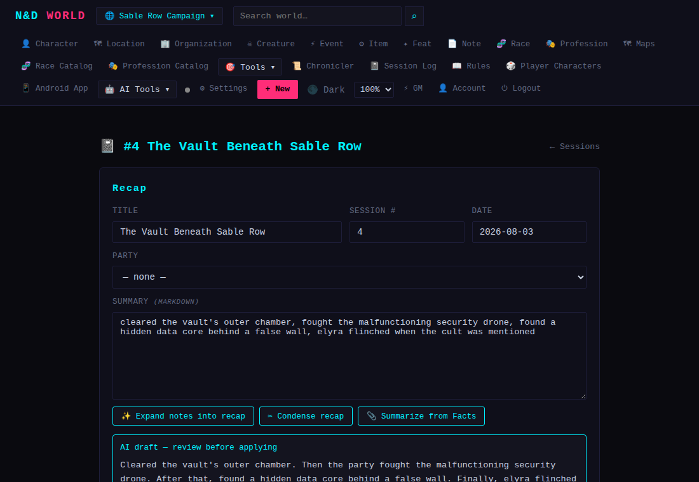

**4. Head to 🗒 Facts and check the existing log.**

Each fact shows its visibility at a glance — a 🔒 lock for GM-only, an 👁 eye
for player-visible. Here, Elyra's secret cult connection is logged right
next to the public facts about the same scene, safely marked hidden.

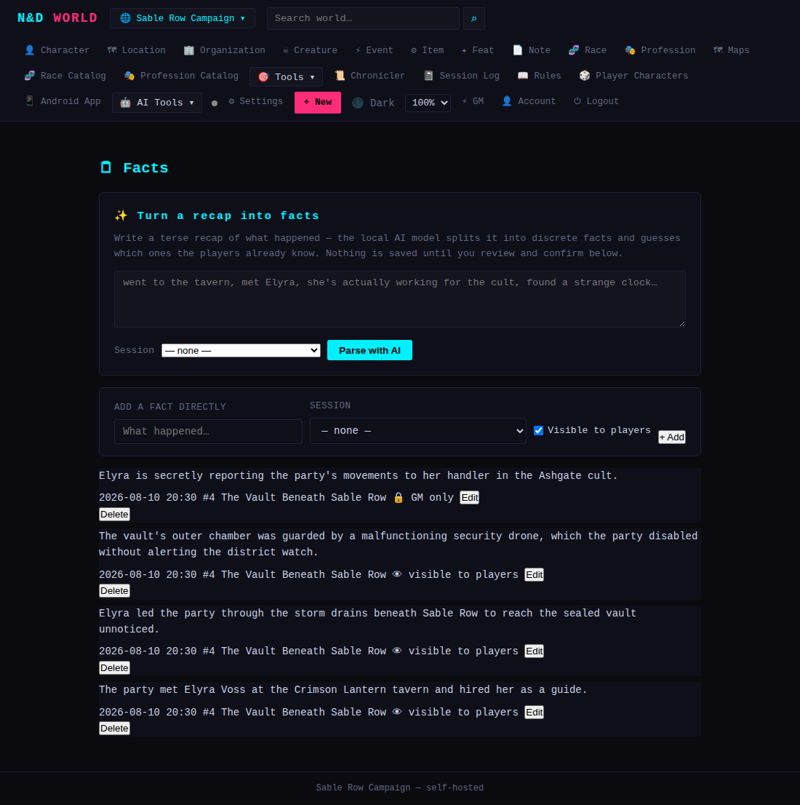

**5. Paste a rough recap into the "Turn a recap into facts" box and click Parse with AI.**

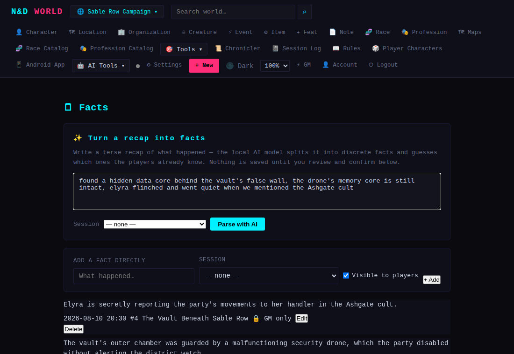

**6. Review the drafted facts before saving anything.**

The model splits your recap into individual facts and guesses which ones the
players already witnessed versus which are secret. Notice it correctly
un-checked "players know" for the line about Elyra reacting to the cult
mention — but you can always override any checkbox, edit the wording, add a
row, or delete one before confirming.

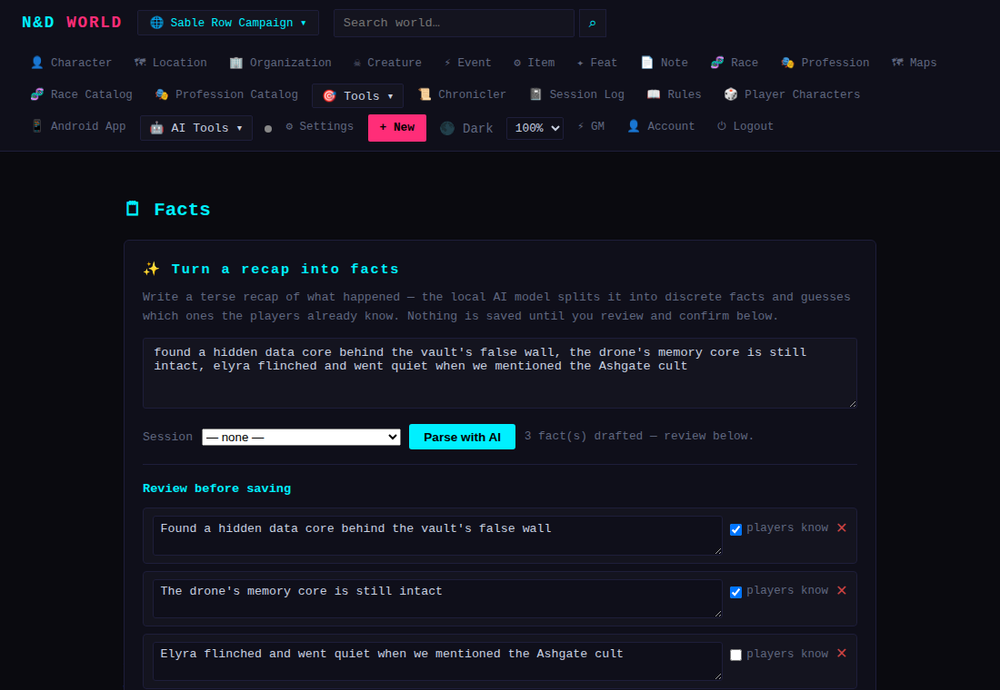

Click **Confirm & Save** and the reviewed facts are appended straight into
the log below — nothing is written before this point.

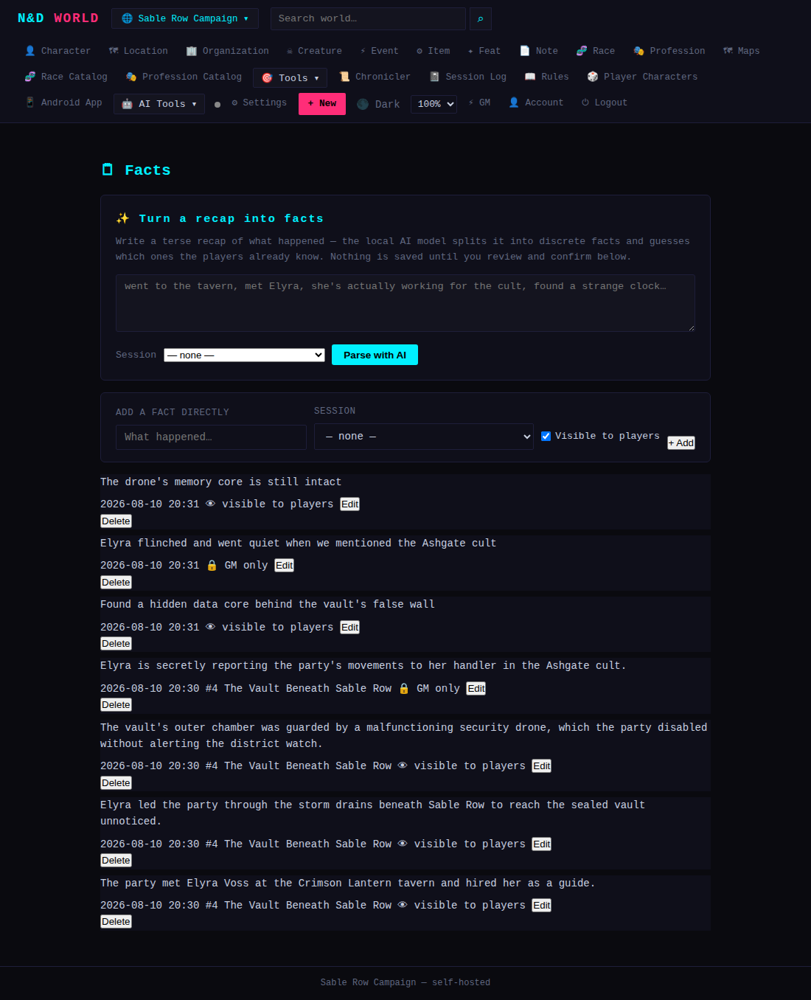

**7. Ask the Chronicler a question as the GM.**

Because you're a GM, the Chronicler's context includes every fact, secret or
not — so it can answer with the full picture.

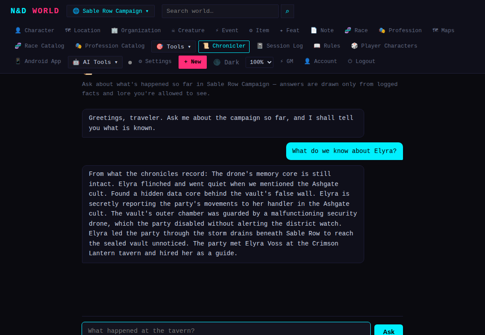

### Step-by-step: Player

**1. Open 📓 Session Log and pick a session.**

Players see the same session list the GM does, but never the GM's raw
Summary text.

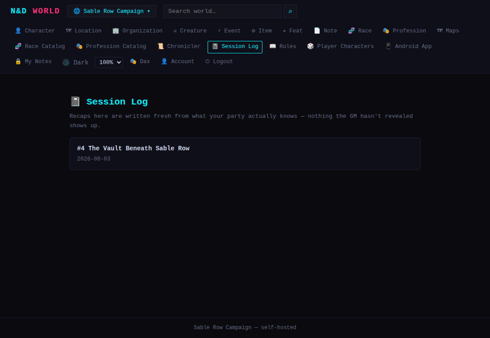

**2. Read the recap — synthesized fresh from only the facts marked visible.**

This text isn't stored anywhere; it's generated on the spot each time the
page loads, from whatever facts for this session are currently flagged
`visible_to_players`. The secret about Elyra and the cult is nowhere in it,
because the underlying Fact was never visible to begin with — not because
the AI was told to hide it.

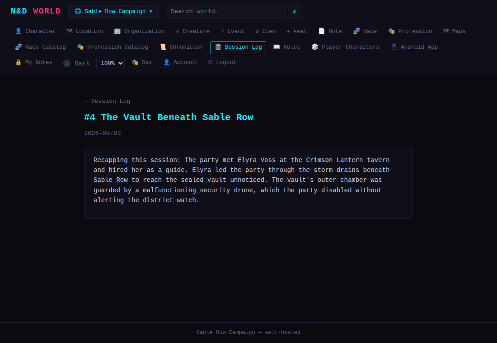

**3. Ask the Chronicler the exact same question the GM asked.**

Same question, same world, different user — and a visibly different answer.
The cult connection simply isn't in the data the player's request ever
touched.

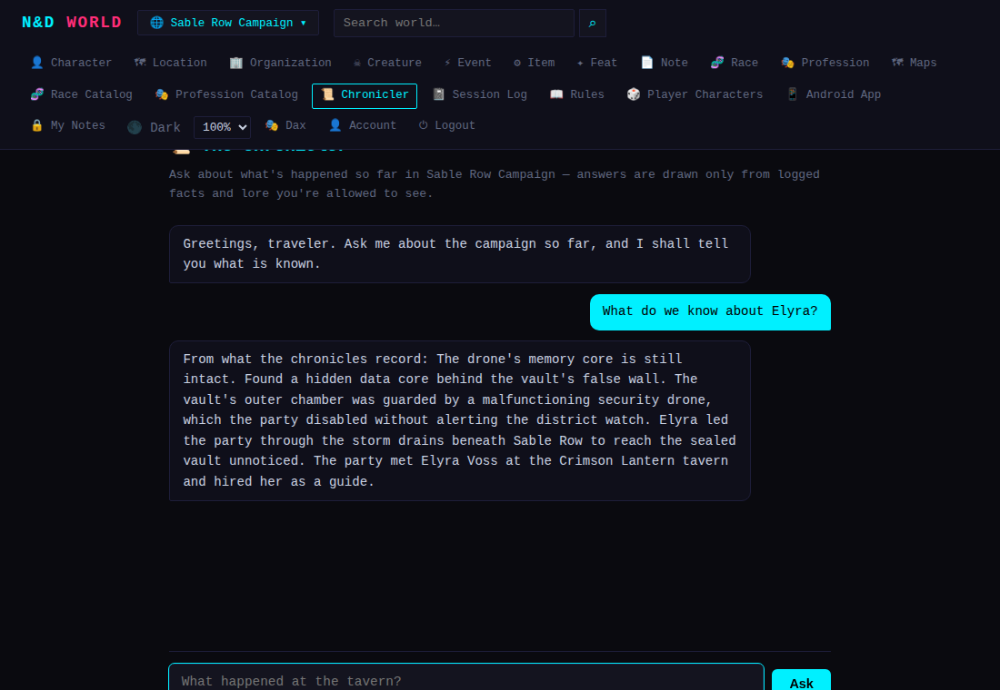

This pair of Chronicler screenshots is the whole point of the Facts system
in one picture: the GM and the player asked the identical question, and the
answer differs only because of what each user is *allowed to see*, enforced
before either question ever reached the model.
